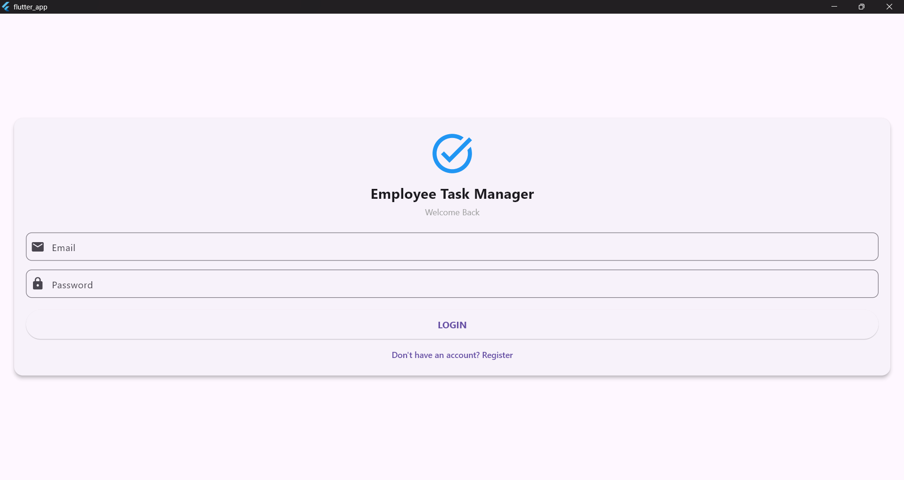
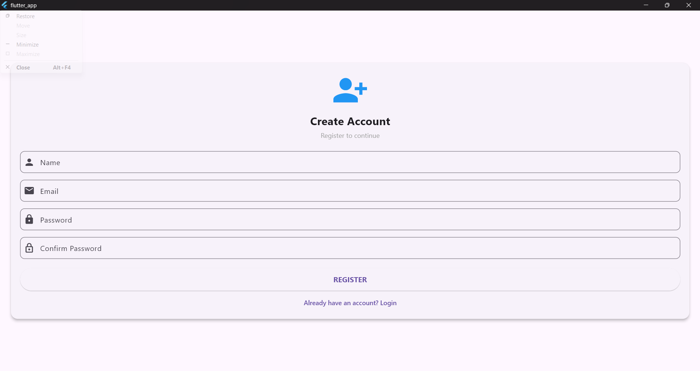
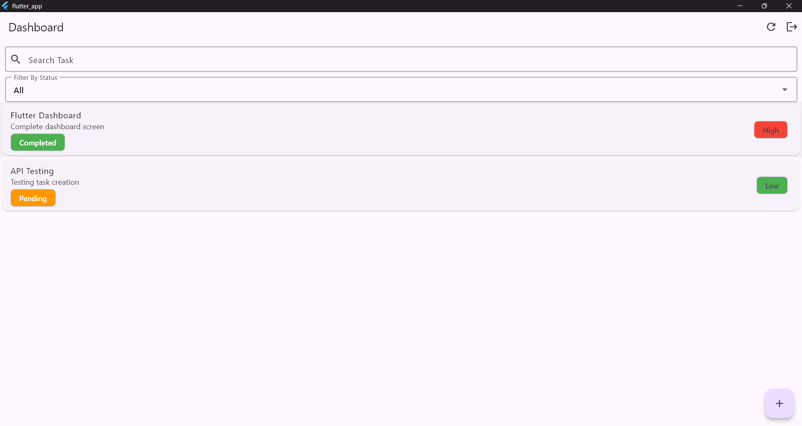

# Employee Task Management System (ETMS)

## Overview

Employee Task Management System (ETMS) is a full-stack application developed using Flutter, FastAPI, and SQLite. The system helps employees manage their daily tasks efficiently through a simple and user-friendly interface.

---

## Technologies Used

### Frontend

* Flutter
* Dart

### Backend

* FastAPI (Python)

### Database

* SQLite

### Authentication

* JWT (JSON Web Token)

---

## Features

### Authentication

* User Registration
* User Login
* JWT Token-Based Authentication
* Logout Functionality

### Dashboard

* View All Tasks
* Search Tasks
* Filter Tasks by Status
* Pull-to-Refresh

### Task Management

* Create Task
* View Task Details
* Update Task
* Delete Task

---

## Project Structure

### Flutter

```text
lib/
├── screens/
├── services/
├── main.dart
```

### Backend

```text
backend/
├── routers/
├── models/
├── schemas/
├── database.py
├── auth_handler.py
├── main.py
```

---

## Database

### Users Table

| Field    | Type    |
| -------- | ------- |
| id       | Integer |
| name     | String  |
| email    | String  |
| password | String  |

### Tasks Table

| Field       | Type    |
| ----------- | ------- |
| id          | Integer |
| title       | String  |
| description | String  |
| priority    | String  |
| status      | String  |
| due_date    | Date    |
| user_id     | Integer |

---

## API Endpoints

### Authentication

#### Register

```http
POST /register
```

#### Login

```http
POST /login
```

---

### Tasks

#### Get All Tasks

```http
GET /tasks
```

#### Create Task

```http
POST /tasks
```

#### Update Task

```http
PUT /tasks/{id}
```

#### Delete Task

```http
DELETE /tasks/{id}
```

---

## How to Run

### Backend

```bash
cd backend
pip install -r requirements.txt
uvicorn main:app --reload
```

### Flutter

```bash
cd flutter_app
flutter pub get
flutter run
```

---

## Screens

1. Login Screen
2. Register Screen
3. Dashboard Screen
4. Task Detail Screen
5. Add/Edit Task Screen

---

## Future Enhancements

* Task Categories
* Task Attachments
* Dark Mode
* Notifications
* User Profile Management

---
## Test Credentials

Email: dhanaraj@gmail.com
Password: 123456

---
## Developed By

Dhanaraj

Employee Task Management System (ETMS)

## Screenshots

### Login Screen



### Register Screen



### Dashboard Screen


